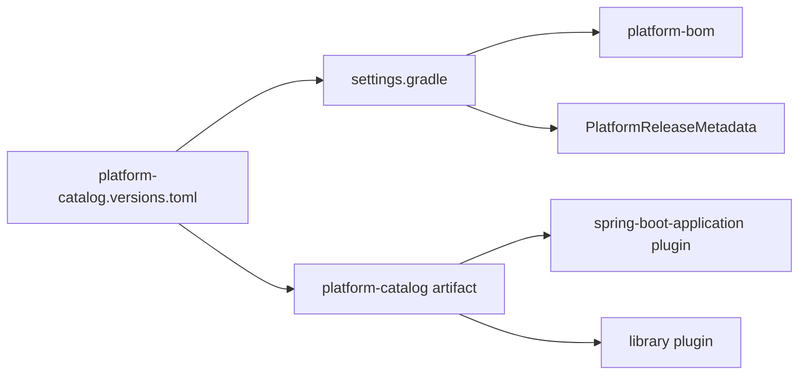

# Platform Release Pack

Multi-module Gradle project producing a versioned, atomic Platform Release Pack for `space.br1440.platform`.

## Modules

| Module | Artifact | Purpose |
|---|---|---|
| `platform-bom` | `space.br1440.platform:platform-bom` | Maven BOM / `java-platform` — dependency constraints |
| `platform-catalog` | `space.br1440.platform:platform-catalog` | Published Gradle Version Catalog |
| `platform-settings-plugin` | `space.br1440.platform:platform-settings` | Settings plugin — bootstrap, repositories, `pluginManagement`, catalog import |
| `platform-spring-boot-application-plugin` | `space.br1440.platform:platform-spring-boot-application` | Spring Boot service convention — Boot + toolchain + BOM |
| `platform-library-plugin` | `space.br1440.platform:platform-library` | Pure Java library convention — `java-library` + toolchain + BOM (no Boot) |

All modules share a single release version taken from the platform catalog.

Two more Gradle projects exist and are deliberately **not** published:

| Project | Purpose |
|---|---|
| `buildSrc` | Precompiled script plugins shared by the five modules: `platform-test-fixtures-publishing`, `platform-nexus-publishing`, `platform-plugin-functional-testing` |
| `platform-gradle-test-support` | `PlatformFunctionalSpec`, the TestKit base class used by the functional tests of all three convention plugins |

## Version ownership

**`platform-catalog/gradle/platform-catalog.versions.toml` is the only source of dependency versions.**

Nothing else declares a version: not `gradle.properties`, not a Groovy constant, not a build script literal. The TOML is consumed three times:

1. `settings.gradle` registers it as the `platform` version catalog for this build;
2. `platform-catalog` publishes it as the consumer-facing catalog artifact;
3. `platform-settings-plugin` generates `PlatformReleaseMetadata` from it.



### Bumping the platform version

Edit **one line** in `platform-catalog/gradle/platform-catalog.versions.toml`:

```toml
[versions]
platform-release = "1.1.0"
```

Then run `./gradlew build`. There is nothing to keep in sync, so there is no consistency gate to satisfy. The same applies to `spring-boot`, `java`, and every library version.

Build scripts read the catalog through `VersionCatalogsExtension`, never through type-safe accessors — the accessor would be named `platform` and would collide with the `platform(...)` dependency notation inside `dependencies { }` blocks.

## Usage

### `settings.gradle` of a consuming service

```groovy
pluginManagement {
    repositories {
        maven { url = uri('https://n.1440.space/repository/platform-maven/') }
    }
}

plugins {
    id 'space.br1440.platform.settings' version '1.0.0'
}

rootProject.name = 'my-service'
```

The `pluginManagement.repositories` block only bootstraps the settings plugin itself. Once applied, the plugin takes over all further plugin and dependency resolution, and service `build.gradle` files must not declare a `repositories {}` block.

The `version '1.0.0'` literal is the single bootstrap pin a service is required to carry. It cannot be sourced from the catalog: the catalog is imported *by* this plugin. Dynamic versions (`latest.release`, `[1.0,2.0)`) are deliberately not supported — they would make service builds non-reproducible and turn a platform release into an uncontrolled simultaneous change across every service.

### `build.gradle` of a consuming Spring Boot service

```groovy
plugins {
    id 'space.br1440.platform.spring-boot-application'
}

dependencies {
    implementation 'org.springframework.boot:spring-boot-starter-web'
    testImplementation 'org.springframework.boot:spring-boot-starter-test'
}
```

### `build.gradle` of a consuming pure Java library

```groovy
plugins {
    id 'space.br1440.platform.library'
}

dependencies {
    api 'org.apache.commons:commons-lang3'
    testImplementation 'org.junit.jupiter:junit-jupiter'
}
```

No BOM coordinates, no Spring Boot version, no `buildscript`, no version literals.

For services the BOM is injected into `implementation`, `compileOnly`, `annotationProcessor`, and the test configurations. For libraries it is also injected into `api` and `compileOnlyApi`, so platform libraries share release-train alignment with their consumers.

## Repository policy

Fail closed. Only internal Nexus proxies are declared, in this build and in the settings plugin:

- `https://n.1440.space/repository/platform-maven/`
- `https://n.1440.space/repository/platform-maven-dev/`
- `https://n.1440.space/repository/plugins.gradle.org-proxy/`
- `https://n.1440.space/repository/repo1.maven.org-proxy`

`gradlePluginPortal()`, `mavenCentral()` and `mavenLocal()` are absent by design. The public repositories are already proxied by Nexus; a silent fallback to them would let a build keep succeeding while resolving artifacts from an unvetted source. `mavenLocal()` additionally makes outcomes depend on `~/.m2` state.

`releasesOnly()` is not applied: `platform-maven-dev` carries the snapshot line and must stay consumable.

## Publishing

```bash
./gradlew publishAllToNexus       # snapshot or release, chosen by the -SNAPSHOT suffix
./gradlew publishAllToMavenLocal  # local verification
```

Credentials are resolved by repository name at execution time:

| Repository | Gradle property | Environment variable |
|---|---|---|
| `nexusSnapshot` | `nexusSnapshotUsername` / `nexusSnapshotPassword` | `ORG_GRADLE_PROJECT_nexusSnapshotUsername` / `...Password` |
| `nexusRelease` | `nexusReleaseUsername` / `nexusReleasePassword` | `ORG_GRADLE_PROJECT_nexusReleaseUsername` / `...Password` |

CI maps these from the corporate `PROD_NEXUS_USERNAME` / `PROD_NEXUS_PASSWORD` variables; see `.gitlab-ci.yml`.

`credentials(PasswordCredentials)` is used rather than an eager `credentials { username = provider.getOrNull() }` block: the eager form resolves the secret at configuration time and writes it into the configuration cache entry on disk.

## Running tests

```bash
./gradlew test                      # all tests, including network resolution
./gradlew test -Dtest.offline=true  # skips tests that resolve from a remote repository
```
